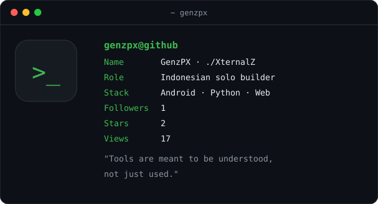
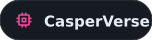
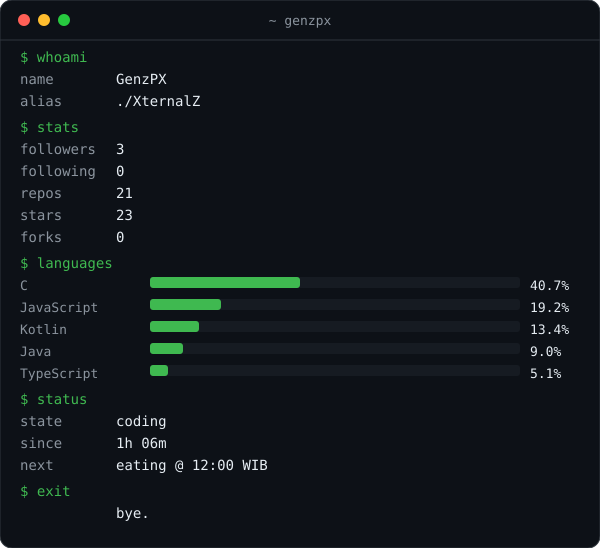
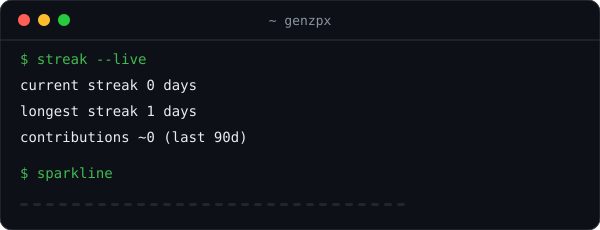

 

 

 

I ship tools that solve my own problems — offline-first Android apps, CLI security tooling, and small systems built from scratch. No framework religion. If I can understand it, I can build it.

---

## 🧰 What I build

<!-- PROJECTS:START -->

### Android

| | Project | What it actually does |
| :--- | :--- | :--- |
|  | [**music**](https://github.com/GenzPx/music) | Offline music and video player for Android with no ads and no internet permission |
|  | [**MonitoredCheck**](https://github.com/GenzPx/MonitoredCheck) | All-in-one Android system monitor and hardware inspector with real, non-fabricated data |
|  | [**SickHack**](https://github.com/GenzPx/SickHack) | Terminal-style web security testing toolkit for Android (educational use only) |
|  | [**ApkStore**](https://github.com/GenzPx/ApkStore) | Android app store backed by GitHub Releases |

### CLI & security

| | Project | What it actually does |
| :--- | :--- | :--- |
|  | [**The-Decoder**](https://github.com/GenzPx/The-Decoder) | Dependency-free CLI for decoding base64, URL, hash and multiple data formats |
|  | [**DOWNLOADER-UX**](https://github.com/GenzPx/DOWNLOADER-UX) | Universal file downloader and URL analyzer for Termux and Linux |
|  | [**security-toolkit**](https://github.com/GenzPx/security-toolkit) | Command-line security toolkit with modules for OSINT, reconnaissance, scraping and reporting |
|  | [**Information-Cracker**](https://github.com/GenzPx/Information-Cracker) | Information-Cracker: OSINT and network analysis command-line tool |

### Experiments

| | Project | What it actually does |
| :--- | :--- | :--- |
|  | [**CasperVerse**](https://github.com/GenzPx/CasperVerse) | CasperAI: a lightweight offline language system built from scratch with NumPy |
|  | [**EduKids**](https://github.com/GenzPx/EduKids) | Interactive learning application for children aged 2 to 7 |

<!-- PROJECTS:END -->

  
  
  
  

---

## ❤️ Skills

Especially, I don't have any skills. But I love:

  
  
  
  
  
  
  
  

  
  
  
  

  
  
  

---

## 📊 Stats

  

  

  

  

---

 

*"Tools are meant to be understood, not just used."*

 

`cd ~/life && ./build --from-scratch`

